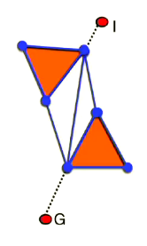
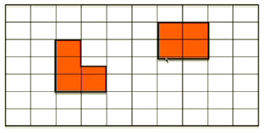
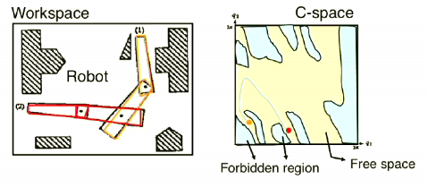
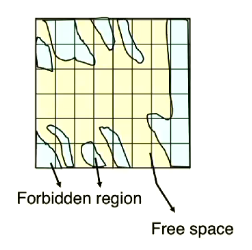
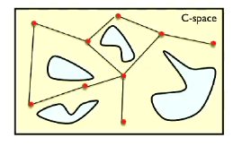

# Lecture 3

## Recall from last lecture...

**BFS** uses a container which is first-in-first-out (FIFO, i.e. Stack).

* In the case of solving the 8-puzzle (at least with the naive implementation, this was fast(ish))

**DFS** uses a container which is first-in-last-out (FILO, i.e. Queue).

* In the case of solving the 8-puzzle this was much slower than BFS.

See Tutorial 2 for more info.

## Heuristics

A heuristic is specified by the designer of an agent, specifically for the search problem. It uses some top-level insight about the problem so that the search algorithm can act in an informed way.

#### Admissible heuristics

A heuristic is **admissible** if it never overestimates the cost

- $h(n) \leq h^*(n)$, where $h^*(n)$ is the true cost to reach the goal from $n$.
- i.e. the estimate never overestimates

For example, Euclidean distance (straight line path) in a maze would be admissible because it never overestimates.

#### Consistent heuristics

A heuristic is **consistent** if, for every node $n$ and for every successor $n'$ of $n$ by any action $a$, the estimated cost to reach the goal for $n$ is **at most** the step cost of getting to $n'$ + the estimated cost of $n'$ to the goal.

In other words, $h$ is **consistent** if:
$$
\forall n \in S, \quad \forall n' \in \mathrm{successor}(n), \quad \forall a \in A \\
h(n) \leq c(n, a, n') + h(n')
$$
where $c(n, a, n')$ is the step cost of getting from $n$ to $n'$ via action $a$.

**Notes:**

* This is a case of the **triangle inequality** which stipulates that each side of a triangle cannot be longer than the sum of the two other sides
  
* Consistent is also called **monotonic**

## Informed search

* Informed search: select which node to expand based on a function of the estimated cost from the current node to the goal state
* Cost: $f(n) = g(n) + h(n)$
  * $g(n)$: cost from the root node of the tree to $n$.
  * $h(n)$: estimated cost from $n$ to the goal (usually based on [heuristics](#Heuristic))
  * In informed search, the node is selected based on $f(n)$, and $f(n)$ must contain $h(n)$.

When compared to blind search, informed search uses a "bias" toward the goal; points way from the goal look "worse" to the search as it progresses.

### Examples of informed search algorithms

* [Greedy best first search](#Greedy-best-first-search)
* [A* search](#A*-search)

### Greedy best first search

* Expand fringe node with lowest estimated cost from the current node to the goal
  * $f(n) = h(n):$ estimated cost from $n$ to the goal based on heuristics
  * $g(n)$: ignored
  * Expand fringe node with the lowest $f(n)$.

For example, recall the navigation app environment from Lecture 2.

In this example, the following estimated costs could be (there are many you can choose--this one is just arbitrary):

* $h($`UQLake`$) := 100$
* $h($`Bld78`$) := 50$
* $h($`AEB`$) := 53$
* $h($`Wordsmith`$) := 9999$
* $h($`Bld42`$) := 50$
* $h($`Bld50`$) := 38$
* $h($`Bld51`$) := 30$
* $h($`Bld7`$) := 0$

Notice the estimated cost of moving further away from the goal (`Bld7`) is higher (moving to `Wordsmith` which is a deadlock is very high) while moving closer gives a lower cost and moving to the goal is the lowest cost ($0$). 

* Almost the same as Uniform Cost search
* Use **priority queue (PQ)** to keep fringe nodes
  * The highest priority in PQ for Greedy Best First is the node with the smallest estimated cost from the current node to the goal (i.e. the heuristic function $h$), rather than the cost from the root to the current node ($g$) as in Uniform Cost.

1. Set the initial vertex $I$ as the root of the search tree
2. Push $I$ to the PQ
3. Loop
   1. Assign $t:=$ the node $n$ from the PQ with the lowest $h(n)$
   2. Remove $t$ from PQ and mark $t$ as expanded
   3. If $t$ is the goal vertex, then return
   4. For each $v$ in `successor(`$t$`)`:
      * Insert $v$ to the PQ
      * Put $v$ as a child of $t$ in the search tree

#### Greedy best first search properties & analysis

- $b$: branching factor
- $m$ maximum depth
- Complete?
  - No (highly depends on heuristic)
  - Imagine trying to navigate a maze where $h(n)$ is just Euclidean distance from $n$ to the goal--if there are obstacles in the way, and the complete path is something with a higher heuristic, GBFS is not going to find it and get stuck
- Optimal (in terms of lowest cost)
  - No (highly depends on heuristic)
- Complexity
  - Highly depends on heuristic
  - Time **and** space: $O(b^m)$

### A* search

* Expand the fringe node with lowest estimated cost from root goal via the node.
  * $g(n)$: Cost from root of the tree to node $n$
  * $h(n)$: Estimated cost from node $n$ to goal  (using heuristics)
  * $f(n) = g(n) + h(n)$
  * Expand fringe node with the lowest $f(n)$

Again, recall the navigation app environment.

Let's use the same example estimated costs which are determined by my almost arbitrary heuristic.

- $h($`UQLake`$) := 100$
- $h($`Bld78`$) := 50$
- $h($`AEB`$) := 53$
- $h($`Wordsmith`$) := 9999$
- $h($`Bld42`$) := 50$
- $h($`Bld50`$) := 38$
- $h($`Bld51`$) := 30$
- $h($`Bld7`$) := 0$

- Almost the same as Uniform Cost search and Greedy Best First search
- Use **priority queue (PQ)** to keep fringe nodes
  - The highest priority in PQ for A* is the node with the smallest combined estimated cost plus distance from the root node from the current node to the goal (i.e. $g + h$), so it combines Uniform Cost search with Greedy Best First search.

1. Set the initial vertex $I$ as the root of the search tree
2. Push $I$ to the PQ
3. Loop
   1. Assign $t:=$ the node $n$ from the PQ with the lowest $f(n) = g(n) + h(n)$
   2. Remove $t$ from PQ and mark $t$ as expanded
   3. If $t$ is the goal vertex, then return
   4. For each $v$ in `successor(`$t$`)`:
      - Insert $v$ to the PQ
      - Put $v$ as a child of $t$ in the search tree

#### A* search properties & analysis

- $b$: branching factor
- $m$ maximum depth
- Complete?
  - Yes as long as all edges have a positive cost (i.e. $\epsilon \gt 0$)
- Optimal (in terms of lowest cost)
  - Yes as long as all edges have a positive cost and [the heuristic is admissible](#Admissible-heuristics)
- Complexity
  - Highly depends on heuristic e.g. [consistency](#Consistency)

#### Proof that A* search is complete as long as all edges have a positive cost

* Do later

#### Proof that A* search is optimal as long as all edges have a positive cost and [the heuristic is admissible](#Admissible-heuristics)

Suppose $C^*$ is the optimal cost. At any moment in time, the set of fringe nodes must contain at least one node that lies in an optimal solution. Let's call this $K$.

Right before a non-optimal goal node, $G'$, is selected from the fringe, we'll have
$$
f(G') = g(G') + h(G') \geq g(G') \geq C^*
$$
while $f(K) \leq C^*$ ($h$ is admissible).

Since A* always chooses fringe nodes with the smallest $f$ value, $G'$ cannot be chosen before $K$. This is true for all levels of $K$.

### A* with revisiting nodes

Revisiting nodes will guarantee optimality regardless of whether the heuristic is admissible or not. Computational complexity takes a hit though. Some options:

* Naïve: **revisit all** vs **discard all**

* Alternative: **Discard a revisited node** if the cost to the node via this new path is more than the cost of reaching the node via a previously found path

  * The solution will be optimal in terms of cost, but may still be quite inefficient, due to revisiting nodes that are in the optimal path

* Works with a [consistent/monotonic heuristic](#Consistent-heuristics) $h(n) \leq c(n, a, n') + h(n')$ where:

  * $c(n, a, n')$ is the cost of going from node $n$ to $n'$ via action $a$.

  

* If the heuristic is consistent/monotonic, when A* expands a node $n$, the path to $n$ is **optimal**.
  
  * Therefore, we don't need to revisit nodes that have been expanded

Therefore, if $h$ is consistent, we can adjust the algorithm for A* to be:

1. Set the initial vertex $I$ as the root of the search tree
2. Push $I$ to the PQ
3. Loop
   1. Assign $t:=$ the node $n$ from the PQ with the lowest $f(n) = g(n) + h(n)$
   2. Remove $t$ from PQ and mark $t$ as expanded
   3. If $t$ is the goal vertex, then return
   4. For each $v$ in `successor(`$t$`)`:
      * **If $v$ has not been expanded**:
        * Insert $v$ to the PQ
        * Put $v$ as a child of $t$ in the search tree

This algorithm is identical to Uniform Cost search except it uses $g+h$ instead of $g$. This algorithm is **complete** and **optimal** as long as $h$ is **admissible** and **consistent**.

#### Proof that if $h$ is consistent, the path to $k$ is optimal when A* expands $K$

Start by assuming $h$ is consistent and $n, n' \in S$ such that $n' \in \mathrm{successor}(n)$. 

Then,
$$
\begin{align*}
f(n) &= g(n) + h(n) \\
&\leq g(n) + c(n, a, n') + h(n') \quad \because h \text{ is consistent}\\
&= g(n') + h(n') \quad \because g(n') = g(n) + c(n, a, n') \\
&= f(n').
\end{align*}
$$
Therefore, $f(n) \leq f(n')$ i.e. $f$ is non-decreasing.

Suppose $K \in S$ is chosen to be expanded. Then $f(K) \leq f(N)$ where $N$ is all other nodes in the fringe (due to the nature of A*).

Suppose $N$ is in a path leading to $K$ via node $N'$. Then $f(K) \leq f(N') \leq f(N)$. Since $h$ is consistent, $h(N') \leq h(K)$ and therefore $g(K) \leq g(N')$.

Hence, the cost to reach $K$ via $N$ is at **least** equal to the cost to reach $K$ when it's first expanded.

#### For a graph search, consistent and admissible heuristic guarantees optimality for regular A*

For a **tree** search, only admissibility is required for optimality.

#### Consistency implies admissibility

Consistent $\implies$ admissible but the converse isn't always true!

So really, the statement above that a consistent and admissible heuristic implies optimality in a graph search can be rewritten to: **The graph-search version of A* is optimal if $h$ is consistent**.

Note: The tree-search version of A* is optimal if $h$ is admissible (because there's no loops and no need to revisit nodes).

#### Consistency is not always great

A basic example is when $h(n) = 0$. Then we simply have Uniform Cost search which isn't ways best.

### How to generate heuristics

We need:

* Information about the problem (domain knowledge)
* Knowledge about the sub-problems
* Learn from prior results of solving the same or similar problems

Examples:

* How can this apply to the 8-puzzle?

## Search in a Continuous Space & Motion Planning

### Agenda

* [Introduction to Motion Planning](#introduction-to-motion-planning)
* [Point robot in a 2D world](#point-robot-in-a-2d-world)
  * Formulating the problem as a search problem and solving it
* [More general case](#more-general-case)
  * Formulating the problem
  * Solving the problem using a Probablistic Roadmap (PRM)

### Introduction to Motion Planning

* Motion planning is the study of computational methods to enable an agent to compute its own motions for moving from a given initial state to a goal state
* Various applications:
  * Solving those tricky Chinese puzzles
  * Assembling cars and planes
  * Computer games

### Point robot in a 2D world

* A point robot operating in a 2D space
* Find a collision-free path between a state and goal position of the robot (i.e. navigate a maze)
* Essentially a search problem but with a **continuous** search and action space
  * Size of state graph?
    * Naively, the size of the state graph is **infinite**
* Could **discretise** the space
* Many ways: e.g.
  * Visibility graph
  * Uniform grid discretisation

#### Visibility graph

* Obstacles are respresented as polygons
* State space = undirected graph where:
  * Nodes are vertices of the obstacles
  * An edge between the two vertices represents an edge of the polygon or a collision-free straight line path between two vertices

* Given initial ($I$) & goal ($G$) states:
  * Find the vertex $q_i$ nearest to $I$, where the straight line segment between $I$ and $q_i$ is collision-free
  * Similarly for $G$
* If each edge is labelled with the length of the path the edge represents, the shortest path can be found by finding the shortest path in the graph
* Complexity ($n$: total # of vertices of the obstaces)
  * Construction time (naive): $O(n^3)$
  * Space $O(n^2)$
* Have been extended (for efficiency) and used in a lot of games

#### Uniform grid discretisation

* Obstacles do not have to be represented as polygons
* Each grid cell that does not intersect with an obstacle becomes a vertex in the state graph. Edges between vertex $v$ and $v'$ means $v$ and $v'$ correspond to neighbouring grid cells
* Use search on state graph as usual

### More general case

* **Articulated robot** operating in a 2D environment

  * A robot that consists of multiple rigid bodies, connected by joints
  * A rigid body: An object where the distance between any 2 points are constant

* **Still use the same formulation**

  * Similar to formulation of a rational agent

* **State space**: The set of all configurations

* **Configuration space / C-Space:** the set of all possible robot configurations

  * 
  * A **configuration** is the parameters that uniquely defines the position of every point on the robot: $q = (q_1, q_2, ..., q_n)$
  * Usually expressed as a vector of the Degrees of Freedom (DOF) of the robot
  * Motion planning: Find a collision-free path in this state space

  

  #### Some terminology in C-Space

  * A configuration $q$ is **collision-free** is the robot placed at $q$ does not intersect any obstacles in the workspace

  * **Forbidden region**
  * The set of coinfigurations that will cause the robot to collide with the obstacles in the environment
  
  * **Free Space**
    
    * $CSpace \setminus ForbiddenRegion$

  **Action space & transition function for the robot**

    * An action: a displacement vector
    * Transition: $q' = q + a$
    
    * Where $q$ and $q'$ are configuratons and $a$ is an action

**Using the same method as for the point robot**

* Visibility graph: polygon?

  * No way, way to frikken complicated :angry:

    

* Unifrom grid discretisation:

  * Each grid cell that does not intersect with an obstacle become sa vertex in the state graph
  * Edges between vertex $v$ and $v'$ means $v$ and $v'$ correspond to neighbouring grid cells

* Problem: #vertices is exponention in #dimension

**Problem with uniform grid discretisation**

* As #joins increases, dimensionality of state space increases
* #grid cells in uniform grid discretisation (i.e. #vertices in state graph) grows exponentially with #dimension of the state space
  * Should not store this state graph explicitly
* #out-edges grows exponentially with #dimension of the state space
  * Complexity of search algs depend on #out-edges in state graph

**A better alternative**

* Build a small state graph that captures on the "important features" of the state space
  * For motion planning, important features = connectivity of free space
* Use sampling to build the graph

More next week...